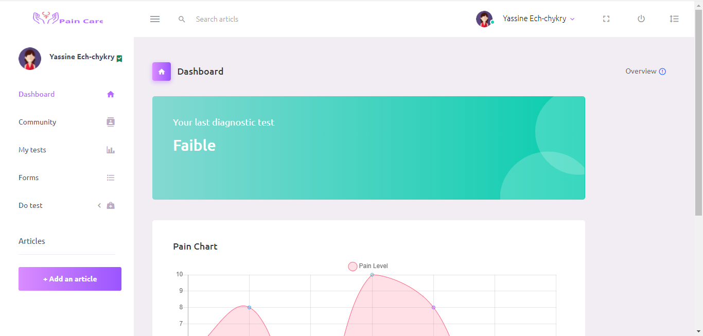

<h1>Pain Care </h1>
A platform exclusively designed for women, allowing them to share their health concerns and pain levels, indicating any specific ailments through diagnostic tests. 

Users can also engage in a community section by posting and commenting on various topics.

Additionally, the application incorporates genuine articles aimed at providing valuable information and support for women's health.

<h1>Tools:</h1>

- Bootstrap 5

<h1>Browser Support:</h1>

Purple Admin is designed to work flawlessly with all the latest and modern web browsers.

- Chrome (latest)
- FireFox (latest)
- Safari (latest)
- Opera (latest)
- IE10+  

<h1>how to run it:</h1>

1. Run Backend folder with apache
2. You can install all the dependencies in the template by running the command npm install. All the required files are in the node modules.
3. Run the front with simple http server 

<h1>Our DB structre:</h1>
